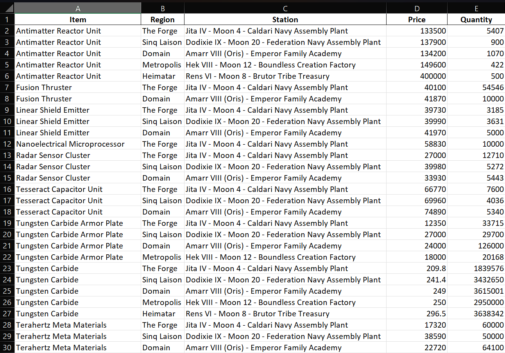

<div id="top"></div>

<!-- PROJECT LOGO -->
<br />
<div align="center">
  <a href="https://github.com/IvanTsukei/EVE-Online-AIOT">
    
  </a>

  <h3 align="center">EVE Online All In One Tool</h3>

  <p align="center">
    Python based program for EVE Online.
    <br />

  Created for [Certh Finley](https://evewho.com/character/94817305)

  </p>
</div>


<!-- TABLE OF CONTENTS -->
<details>
  <summary>Table of Contents</summary>
  <ol>
    <li>
      <a href="#about-the-project">About The Project</a>
      <ul>
        <li><a href="#Requirements">Built With</a></li>
      </ul>
    </li>
    <li>
      <a href="#getting-started">Getting Started</a>
    </li>
    <li><a href="#contributing">Contributing</a></li>
    <li><a href="#license">License</a></li>
  </ol>
</details>


<!-- ABOUT THE PROJECT -->
## About The Project

<div align="center">
  <a href="https://github.com/IvanTsukei/EVE-Online-AIOT">
    
  </a>
</div>
<br />
<br />

This program currently only allows for you to set requirements for Buy/Sell quantities and price of items and returns a list of stations
within your set systems that meets your criteria. The output is an excel file, named "Market_Sell_Data" by default, which saves to data/outputs.

<p align="right">(<a href="#top">back to top</a>)</p>


### Requirements

Please ensure each of the following are installed otherwise the program will not run. Use <b>pip install</b> in powershell.

* [pandas](https://pandas.pydata.org/docs/)
* [pandas-datareader](https://pandas-datareader.readthedocs.io/en/latest/)
* [NumPy](https://numpy.org/)
* [openpyxl](https://openpyxl.readthedocs.io/en/stable/)
* [configparser](https://pypi.org/project/yfinance/)
* [xlsxwriter](https://xlsxwriter.readthedocs.io/)

<p align="right">(<a href="#top">back to top</a>)</p>


<!-- GETTING STARTED -->
## Getting Started

Once all of the above libraries are installed, simply run the program from:
  ```sh
  main.py
  ```
from the main directory. The program will take between 2-5 minutes to run. You can change certain parameters within the config.ini file found within the data folder.


<!-- CONTRIBUTING -->
## Contributing

Open to any contributions that improve performance, fix bugs, or add useful new functionalities to the program. 

<p align="right">(<a href="#top">back to top</a>)</p>


<!-- LICENSE -->
## License

Distributed under the MIT License. See [here](https://opensource.org/licenses/MIT) for more information.

<p align="right">(<a href="#top">back to top</a>)</p>
